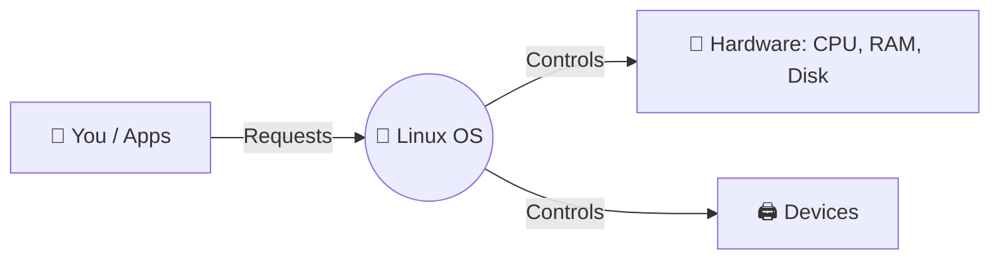
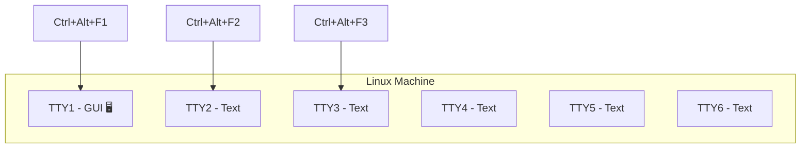
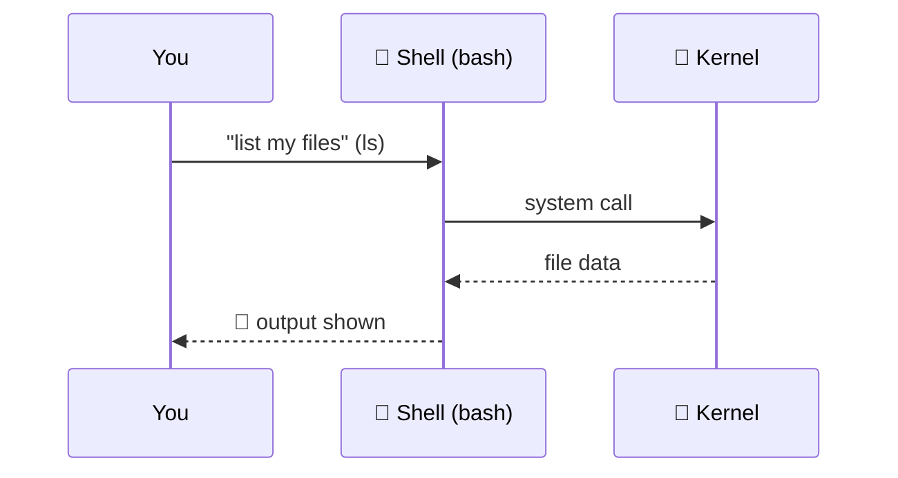
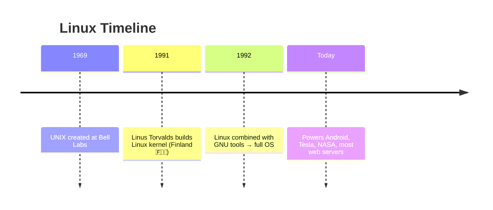
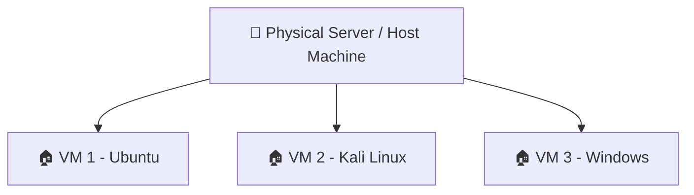
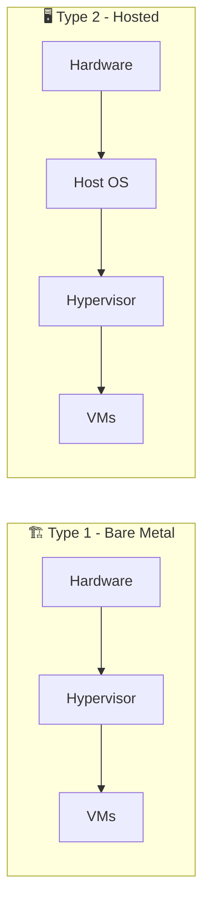
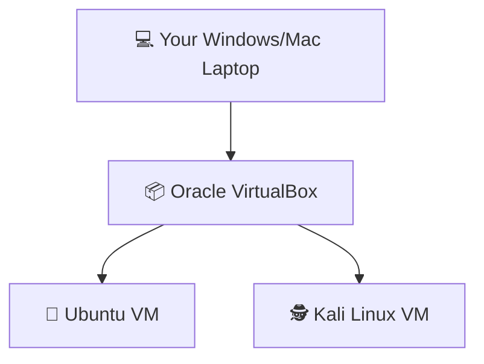
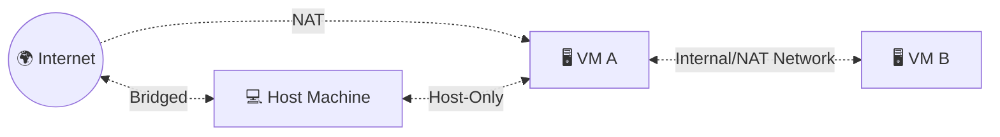
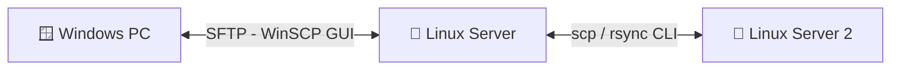
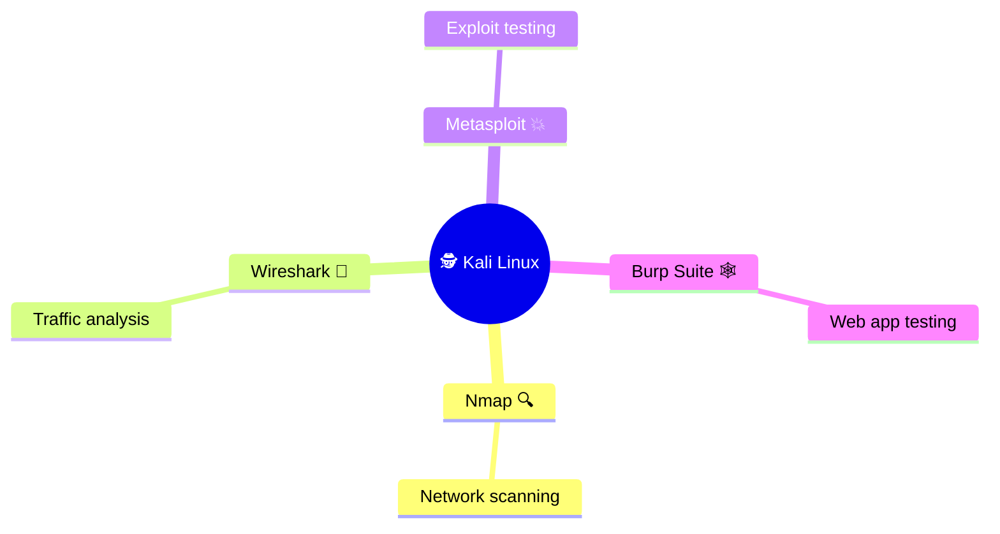

<div align="center">

# 🐧 Linux Learning Journey — Day 1

### *From "What is Linux" to Ethical Hacking with Kali — the visual way*


*A beginner's notes — visual, quick, and practical. No boring theory walls. 🚀*

</div>

---

## 🗺️ Quick Navigation

| 🧩 Topic | 🔑 One-liner |
|---|---|
| [🐧 What is Linux](#-1-what-is-linux) | The manager running everything behind the scenes |
| [🖥️ TTY Sessions](#️-2-terminal-sessions-behind-the-gui) | Secret rooms behind your desktop |
| [🐚 Shell](#-3-what-is-a-shell) | Your translator to talk to the kernel |
| [📜 Linux History](#-4-history-of-linux) | One student, 1991, and the internet today |
| [📦 Distributions](#-5-linux-distributions) | Same engine, different cars |
| [☁️ Virtualization](#️-6-virtualization) | One building, many flats |
| [🧠 Hypervisors](#-7-hypervisors--types) | The landlord of virtual machines |
| [📦 Oracle VirtualBox](#-8-oracle-virtualbox) | TV inside a TV |
| [🌐 Network Adapters](#-10-network-adapter-types) | Who can talk to whom |
| [📁 File Transfer](#-11-file-transfer-winscp--scp) | Moving files safely between servers |
| [🕵️ Kali Linux](#️-12-why-kali-linux) | The hacker's ready-made toolbox |

---

## 🐧 1. What is Linux


Linux = the **manager** between your hardware and your apps.



> 💡 **Real scenario:** A company skips paying for 50 Windows licenses → installs **Ubuntu Server** free → saves money, gets rock-solid uptime.

---

## 🖥️ 2. Terminal Sessions Behind the GUI

Even with a graphical desktop open, Linux keeps **6 virtual terminals** running quietly in the background.



> 💡 **Scenario:** Your desktop **freezes** 🥶 → press `Ctrl+Alt+F3` → kill the frozen app from a clean text session → desktop is saved without a restart.

---

## 🐚 3. What is a Shell?

<details>
<summary>🔽 Click to see how a Shell works (Waiter Analogy)</summary>



</details>

**Popular shells:** `bash` 🅱️ `zsh` ⚡ `sh` 🔹 `ksh` 🔸

> 💡 **Scenario:** Admin manages **100 remote servers** → writes ONE bash script → updates all servers in minutes instead of clicking through each one manually.

---

## 📜 4. History of Linux



> 🧠 Linux ≠ copied UNIX. It was **inspired by** UNIX but written completely from scratch, then made open-source.

---

## 📦 5. Linux Distributions

| 🚗 Distro | 🎯 Best For | Vibe |
|---|---|---|
| 🟠 **Ubuntu** | Beginners, daily use | Family car |
| 🔵 **Debian** | Stability | Reliable van |
| 🔴 **Fedora** | Latest features | Sports car |
| ⚫ **Kali Linux** | Hacking/security | Race car |
| 🟣 **CentOS/RHEL** | Enterprise servers | Heavy truck |

Same **engine (kernel)** 🔧 → different **cars (distros)** built on top.

---

## ☁️ 6. Virtualization



One building 🏢 → many independent flats 🏠 → each isolated, sharing the same physical resources.

> 💡 **Scenario:** One laptop, but you want Windows Server skills **AND** Kali hacking skills → run both as VMs on the same machine, zero extra hardware cost.

---

## 🧠 7. Hypervisors & Types



| Type | Runs On | Example | Used By |
|---|---|---|---|
| 🏗️ **Type 1** | Directly on hardware | VMware ESXi, Hyper-V | Data centers |
| 🖥️ **Type 2** | On top of an OS | **VirtualBox**, VMware Workstation | Students & learners |

---

## 📦 8. Oracle VirtualBox

<div align="center">

**"A TV playing inside your TV" 📺➡️📺**

</div>



## 🎯 9. Why Oracle VM?

✅ Free & open-source &nbsp;|&nbsp; ✅ Safe sandbox to break things &nbsp;|&nbsp; ✅ Snapshots (undo button 🔁) &nbsp;|&nbsp; ✅ Practice networking safely

---

## 🌐 10. Network Adapter Types



| 🌐 Network Type | VM→Host | VM→VM | VM→Internet | Internet→VM |
|---|:---:|:---:|:---:|:---:|
| 🟡 **NAT** | ❌ | ❌ | ✅ | ❌ |
| 🟢 **NAT Network** | ❌ | ✅ | ✅ | ❌ |
| 🔵 **Bridged** | ✅ | ✅ | ✅ | ✅ |
| 🟣 **Host-Only** | ✅ | ✅ | ❌ | ❌ |
| ⚫ **Internal Network** | ❌ | ✅ | ❌ | ❌ |

> 💡 **Scenario:** Hacking lab setup → Kali + victim VM on **Internal Network** → they attack each other, but total isolation from real internet/host. 🔒

---

## 📁 11. File Transfer: WinSCP & scp



**Windows ➡ Linux (WinSCP):** connect via SFTP → drag & drop files between two panels.

**Linux ➡ Linux (Terminal):**
```bash
scp report.txt admin@192.168.1.50:/home/admin/documents/
```

> 💡 **Scenario:** Nightly backup script uses `scp` + `cron` to auto-copy database backups from **Server A ➜ Server B** every night. 🌙

---

## 🕵️ 12. Why Kali Linux?

<div align="center">

**"A fully-stocked electrician's toolbox 🧰 — 600+ tools, ready on day one"**

</div>



**How much should a beginner know?** Just 4 tools to start: `Nmap` `Wireshark` `Metasploit` `Burp Suite` + basic networking. Go deeper later. 🎓

> 💡 **Scenario:** Ethical hacker scans a company's servers with **Nmap** before launch day → finds an open vulnerable port → devs patch it before real attackers find it. 🛡️

---

<div align="center">
*More notes coming as the Linux journey continues...* 🐧🚀

</div>
