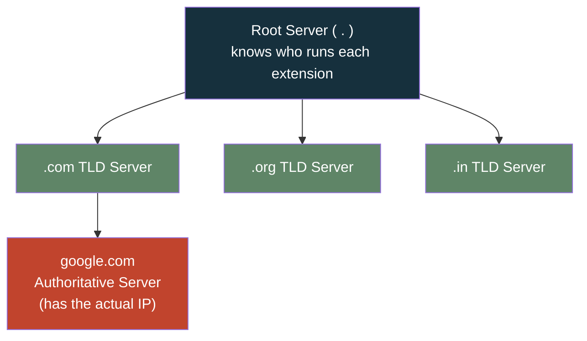
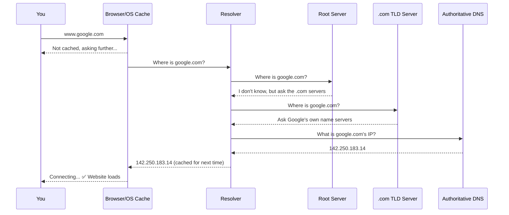
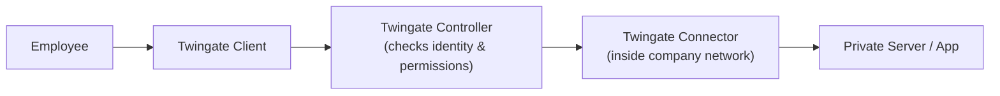

# 📮 DNS, Explained Like a Post Office

> A beginner-friendly walkthrough of how DNS actually works — from "why does this exist" to every record type you'll run into.

DNS (**Domain Name System**) is the internet's phonebook. You write a name on the envelope (`google.com`), and a chain of sorting offices figures out the real address (`142.250.183.14`) and gets your request delivered.

---

## 📖 Table of Contents

- [Why DNS Exists](#-why-dns-exists)
- [The DNS Hierarchy](#-the-dns-hierarchy)
- [A Full DNS Lookup, Step by Step](#-a-full-dns-lookup-step-by-step)
- [DNS Record Types](#-dns-record-types)
- [The Zone File](#-the-zone-file)
- [DoH vs DoT](#-doh-vs-dot)
- [Quick Aside: Twingate](#-quick-aside-twingate)
- [What to Learn Next](#-what-to-learn-next)

---

## 🤔 Why DNS Exists

You don't memorize your friend's phone number — you save their name, and your phone looks up the number.

| You do this | Your device does this |
|---|---|
| Tap **"Rahul"** | Looks up `+91 98765 43210` and dials it |
| Type **`google.com`** | Looks up `142.250.183.14` and connects |

Without DNS, you'd have to type raw IP addresses to visit any website.

---

## 🏢 The DNS Hierarchy

No single server knows every domain on earth — that's ~10 billion websites. Instead, DNS is split into layers, each responsible for a small slice of the map.



- **Root server** — doesn't know Google's IP, only knows who manages `.com`, `.org`, `.in`, etc.
- **TLD server** — doesn't know Google's IP either, only knows who manages `google.com`.
- **Authoritative server** — this is where the real answer lives.

---

## 🔍 A Full DNS Lookup, Step by Step

Here's what happens the instant you type `www.google.com` and hit enter:



**Why so many hops?** Each server only knows part of the puzzle — like a librarian who doesn't know every book, but knows exactly which shelf to point you toward.

---

## 🗂️ DNS Record Types

Every domain keeps a stack of "index cards" (records) at its authoritative server. Click each one to expand.

<details>
<summary><b>A — Address (IPv4)</b></summary>

Maps a domain to an IPv4 address.

```
example.com  →  192.168.1.10
```
📎 *Real-life analogy: a home street address.*
</details>

<details>
<summary><b>AAAA — Address (IPv6)</b></summary>

Maps a domain to an IPv6 address — the newer, longer version.

```
example.com  →  2404:6800:4003::200e
```
📎 *Real-life analogy: the same address, written in a longer newer format.*
</details>

<details>
<summary><b>CNAME — Alias</b></summary>

Points one hostname to another hostname instead of storing an IP directly.

```
www.google.com  →  google.com  →  IP
```
📎 *Real-life analogy: a nickname that redirects to your real name.*
</details>

<details>
<summary><b>MX — Mail Exchange</b></summary>

Tells the internet where email for this domain should go.

```
gmail.com  →  mail server
```
📎 *Real-life analogy: the building's mailroom for incoming letters.*
</details>

<details>
<summary><b>NS — Name Server</b></summary>

Tells the internet who is authoritative for (manages) this domain.

```
google.com  →  ns1.google.com, ns2.google.com
```
📎 *Real-life analogy: the office in charge of maintaining this address.*
</details>

<details>
<summary><b>PTR — Reverse DNS</b></summary>

The opposite of an A record: IP → name instead of name → IP. Commonly used for email verification and troubleshooting.

```
142.250.183.14  →  google.com
```
📎 *Real-life analogy: caller ID, but for IP addresses.*
</details>

<details>
<summary><b>TXT — Text Record</b></summary>

Stores arbitrary text tied to a domain — commonly used for SPF, DKIM, DMARC, and domain-ownership verification.

```
example.com  →  "v=spf1 include:_spf.google.com ~all"
```
📎 *Real-life analogy: a sticky note proving who owns the mailbox.*
</details>

---

## 📄 The Zone File

All of a domain's records live together in one plain-text file, kept at the authoritative server:

```dns
example.com.     IN A     192.0.2.10
www              IN CNAME example.com.
mail             IN A     192.0.2.20
example.com.     IN MX 10 mail.example.com.
example.com.     IN TXT   "v=spf1 include:_spf.example.com ~all"
```

Each line is one record: a name, a type, and a value — same shape as the flip cards above.

---

## 🔐 DoH vs DoT

Plain DNS queries travel like a postcard — anyone on the network path can read them. Both of these approaches seal that postcard in an envelope.

| | **DoH** (DNS over HTTPS) | **DoT** (DNS over TLS) |
|---|---|---|
| Transport | HTTPS | TLS |
| Port | 443 | 853 |
| Traffic pattern | Blends in with normal web traffic | Its own dedicated, identifiable channel |
| Easier to... | Bypass network-level filtering | Monitor and manage on a network |

---

## 🛡️ Quick Aside: Twingate

**Twingate is not a DNS server.** It's a Zero Trust Network Access (ZTNA) tool — often confused with DNS because it also sits "in the middle" of a connection.



Instead of handing someone the keys to the whole network (like a traditional VPN), it verifies identity and device, then unlocks access to *only* the specific app they're authorized for.

---

## 🚀 What to Learn Next

Once the flow above makes sense, these follow-on topics click into place fast:

- **Caching & TTL** — how long a resolver remembers an answer before asking again
- **Split-horizon DNS** — returning different answers depending on who's asking
- **Load balancing via DNS** — spreading traffic across multiple IPs
- **Managed DNS services** — AWS Route 53, Azure DNS, Google Cloud DNS

---

<sub>💡 Want the fully animated, click-through version with a live "send a letter" DNS simulator? GitHub strips JavaScript from rendered README files, so that version only works as a standalone HTML file — open it locally in a browser, or host it with GitHub Pages if you want it live on the web.</sub>
